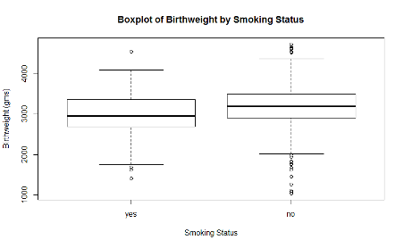
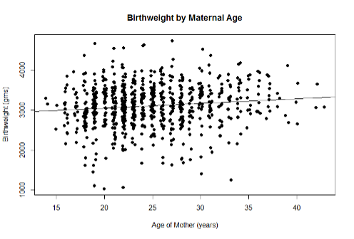

Note: This study was done independently as a part of the Biostatistics course final. 

# Birthweight and Maternal Age in Rural South Africa

## Introduction
The goal of this study is to determine how maternal risk factors are associated with perinatal mortality. Specifically, my goal is to investigate how mother’s age is associated with birthweight of the infant. In statistical terms, I want to determine how the mean birthweight differs across maternal age. My hypothesis is that advanced maternal age is associated with low birthweight, because older mothers are believed to have more anatomical or physiological complications during carriage and birth than younger mothers.

The data come from Western Cape, South Africa where a cohort study was conducted among 755 pregnant women in a transitional rural, urban setting. These women were followed from enrollment to delivery, where characteristics of the infant were determined at birth. To address if maternal age is associated with birthweight, I used simple linear regression as well as multiple linear regression to investigate the association. I used maternal age as a continuous predictor, and birthweight as a continuous outcome. For the multiple regression analysis, I adjusted for sex of infant, smoking status of mother and parity. 

We found association between maternal age and birthweight using simple linear regression, with advanced maternal age tending to have association with higher birthweight. However, when adjusted for sex of infant, smoking status and parity, we found no evidence that there is association between maternal age and birthweight. In conclusion, we do not have sufficient evidence to say that advanced maternal age is associated with lower birthweight.  

## Method
To investigate the association between mother’s age and birth weight, I used linear regression with the model demonstrated below. birthweight is the outcome, and maternal age is the exposure.  

`E[Birth Weight│Maternal Age]= βo+ β1 ×[Maternal Age]`

However, sex of the infant also determines his or her birthweight and therefore is associated with the outcome in our model. Smoking and parity are also known to determine the birthweight, due to anatomical and physiological complications on the mother during pregnancy and delivery. Parity is assumed to be a confounder because older mothers tend to have had more births than younger mothers.  To adjust for these factors and improve precision of our estimate, I included sex of infant, smoking status of mother as precision variables and parity as a confounding variable in the multiple linear regression model.

`E[Low Birth Weight│Maternal Age,Sex of Infant,Smoking Status,Parity]= βo+ β1 ×[Maternal Age]+ β2 ×[Sex of Infant]+ β3 ×[Smoking Status]+ β4 ×[Parity]`

## Descriptive Statistics



The boxplot comparing smokers and nonsmokers show that mothers who smoke tend to give birth to babies with lower birthweight than who do not smoke. As a result, the plot tells us that smoking status is definitely a precision variable that should be adjusted for to improve our precision.



Plotting maternal age and birthweight, the scatterplot does not have evidence for association, since the correlation coefficient is almost close to zero. There also seems to be non-constant variance as well, even though linearity is present.

## Results

Using simple linear regression, we assume approximate linearity, normality, constant variance and independence. From the analysis, we have evidence to believe that older mothers tend to have babies with higher birth weight (p=.001). We estimate that the mean difference in birthweight between two mothers differing by one year in age is 11.43 gms, with older mothers being associated with higher birthweight. This estimated difference would not be surprising if the true difference was between 4.66 gms and 18.20 gms. 
```
|               | Estimate      | 95% CI       | P-value |
| ------------- |---------------| -------------|---------|
| Intercept     | 2823          | [2650, 2996] |         |
| Age           | 11.43         | [4.66, 18.20]| .001    |
```
For the multiple linear regression analysis, we still assume linearity, normality, constant variance and independence in the observations. The estimate for the mean difference in birthweight between older mothers and younger mothers changed after adjusting for age, sex, smoker and parity. This is due to the presence of a confounding variable, which is parity. However, the multiple linear regression does not provide sufficient evidence to suggest that maternal age is associated with birth weight. We estimate that the difference in mean birthweight between two mothers differing by one year in age with same smoking status, sex of baby and parity is 6.96 gms, with older mothers having higher birthweight when adjusted for age, sex, smoker and parity. The estimated difference would not be judged unusual if the true difference was between 4.66 gms and 18.20 gms. This association was not found to be statistically significant (p=0.18). 
```
|               | Estimate      | 95% CI           | P-value |
| ------------- |---------------| -----------------|---------|
| Intercept     | 2823          | [2650, 2996]     |         |
| Age           | 11.43         | [4.66, 18.20]    | 0.18    |
| Sex           | -99.81        | [-174.90, -24.72]|         |
| Smoker        | 196.90        | [117.30, 276.50] |         |
| Parity        | 33.77         | [-11.35, 78.89]| |         |
```
One limitation to linear regression analysis is that it is sensitive to outliers, which can have huge effects on determining the association. To avoid this, I could have fit log-transformed outcome which is less sensitive to outliers. 

## Conclusion
From simple linear regression, we saw that there is association between maternal age and birthweight, where advanced maternal age tends to produce higher birthweight than lower maternal age. However, the multiple linear regression shows that adjusting for different risk factors such as sex of infant, smoker, and parity, there is no evidence of association between maternal age and birthweight. Therefore, I cannot say that advanced maternal age is associated with low birthweight, when there is no association between the two variables.  
